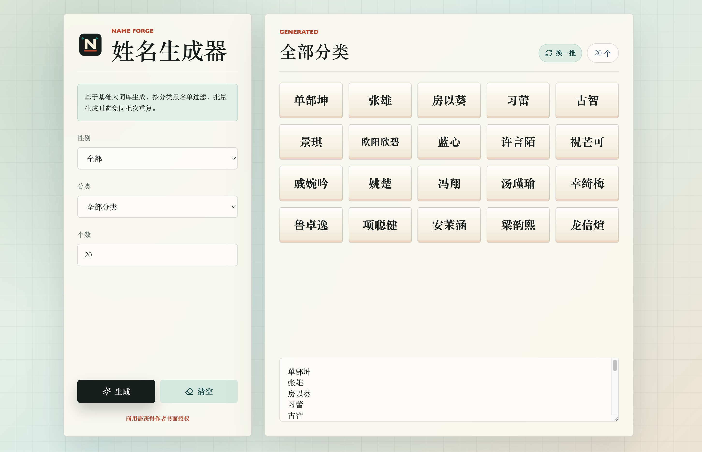

## 姓名生成器

一个面向角色创作的姓名生成器，支持分类词库和双字名声调组合。

[在线地址](http://name.aaqq.in/)



### 分类逻辑

分类不是简单标签，也不是为每个分类手写一批固定名字。现在采用“基础大词库 + 分类黑名单”的模式：

- 仙侠：过滤 `国`、`建`、`军` 等明显现代/年代感/生活化常用字。
- 现代都市：过滤 `客`、`刀`、`剑` 等强武侠、兵器、玄幻色彩字。
- 江湖武侠：过滤现代年代感、商务感和软萌网感字。
- 玄幻：过滤过于现实、年代感和日常生活化的字。

双字名会应用声调规则：一二声搭配三四声，或三四声搭配一二声；姓氏不参与声调判断。同一批生成中，姓和名都不会重复。

### 数据接口

Agent 可以直接获取静态数据：

```text
/api/name-data.json
```

本地开发地址：

```text
http://127.0.0.1:5173/api/name-data.json
```

OpenAPI 描述：

```text
/api/openapi.json
```

### Agent Skill

仓库内置了接口 skill：

```text
.agents/skills/name-generator-api/SKILL.md
```

### 商用授权

本项目、数据接口、生成数据、Logo 和页面设计仅允许非商业使用。商业使用必须获得作者书面授权。
